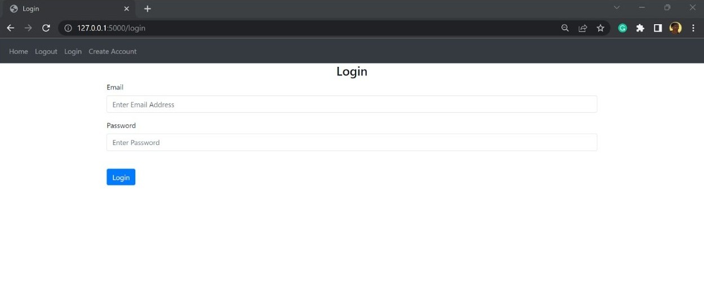
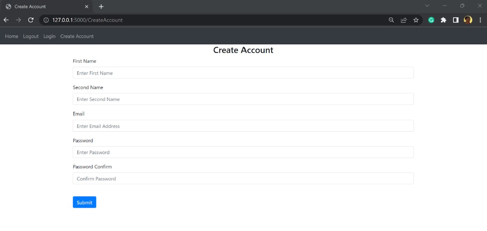
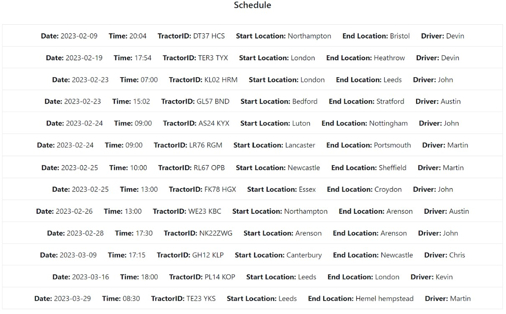
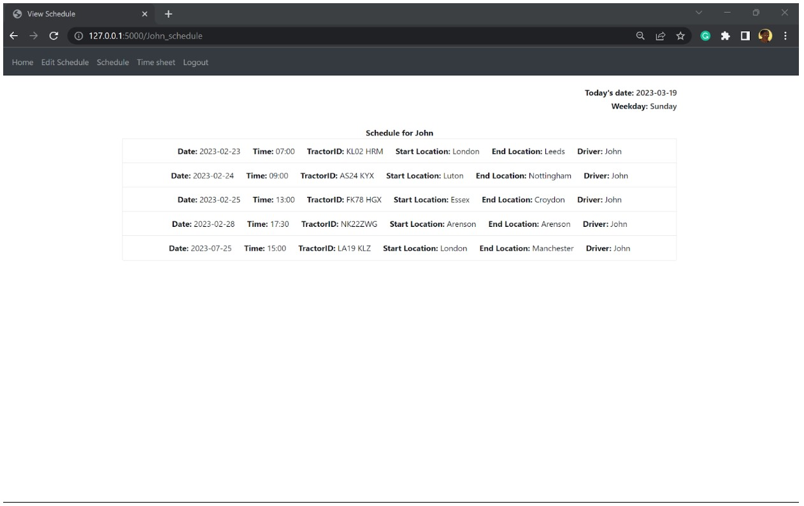
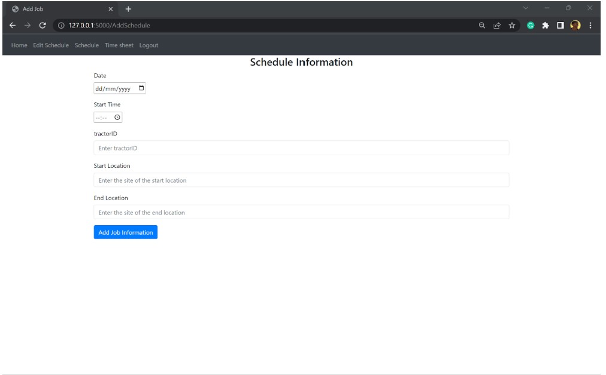
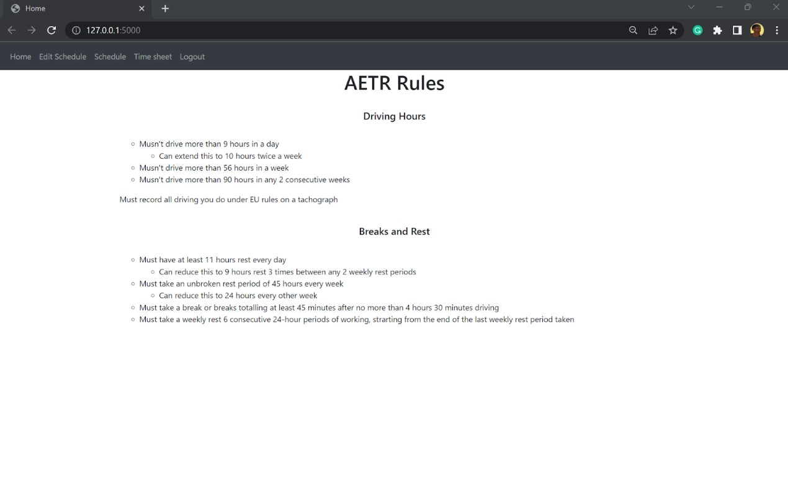

# Haulage Time Tracking & Scheduling System

A web-based platform for tracking, managing, and scheduling truck haulage times in accordance with EU and AETR driving regulations. The system ensures that drivers and managers can monitor working hours accurately while staying compliant with legally mandated driving and rest limits.

---

## 📖 Overview

This project provides a role-based system where managers and drivers have different levels of access:

- **Managers** can view all drivers, edit individual driver records, and oversee schedules.
- **Drivers** can only view their own driving and rest times.
- The system supports account creation and secure login

The platform is designed to help haulage companies prevent breaches of EU/AETR laws by giving users a clear and structured view of their driving data.

---

## 🔑 Features

- Role-based permissions (Manager / Driver)
- Secure user login & registration
- View, edit, and manage driving/rest periods
- Manager dashboards for full driver oversight
- Individual driver dashboards for personal records
- SQL database for data storage
- Flask backend and dynamic web pages

---

## 🛠️ Technologies Used

- **Python**
- **Flask**
- **SQL** (SQLAlchemy)
- HTML / CSS 
- Standard Python libraries for time/date handling

---

## 📷 Screenshots

<table>
  <tr>
    <td align="center">
      <br>
      <sub>Login Page</sub>
    </td>
    <td align="center">
      <br>
      <sub>Account Creation</sub>
    </td>
  </tr>
  
  <tr>
    <td align="center">
      <br>
      <sub>Manager Dashboard</sub>
    </td>
    <td align="center">
      <br>
      <sub>Driver Dashboard</sub>
    </td>
  </tr>

  <tr>
    <td align="center">
      <br>
      <sub>Add Schedule</sub>
    </td>
    <td align="center">
      <br>
      <sub>AETR Driving Laws</sub>
    </td>
  </tr>
</table>

---

## 🛠️ Installation & Setup

1. Clone the repository:
   ```bash
   git clone https://github.com/JonathanNwebube/Truck-Haulage-Tracker
   ```
2. Install dependencies:
   ```bash
   pip install -r requirements.txt
   ```
3. Start the Flask development server:
   ```bash
   python main.py
   ```
4. Open your browser at:
   ```
   http://127.0.0.1:5000
   ```

---

## 📁 Project Structure

```
project/
│── main.py
│── README.md
│── requirements.txt
│── Psuedo.txt
│── NEA.docx
│
├── screenshots/                # Images used in README
│   ├── login.jpg
│   ├── account-creation.jpg
│   ├── manager-dashboard.jpg
│   ├── schedule-dashboard.jpg
│   ├── adding-schedule.jpg
│   └── AETR-Laws.jpg
│
└── website/
    ├── __init__.py
    ├── backend.py             # Core Flask route handling
    ├── database.py            # SQLAlchemy models (User, Job, Days, Week)
    │
    ├── static/
    │   └── index.js           # JavaScript for front-end functionality
    │
    └── templates/             # HTML templates (Flask front-end)

```

---

## 🔍 How the System Works

1. **User Authentication**  
   - Users create an account and sign in securely.  
   - Passwords are hashed and managed by Flask-Login.  
   - Sessions persist until logout.

2. **Role-Based Access Control**  
   - **Drivers** can only view their personal driving/rest times.  
   - **Managers** can view & edit *all* drivers, schedules, and hours.

3. **Scheduling & Driving Time Tracking**  
   - Dates, times, tractor IDs, and start/end locations are stored in the SQL database.  
   - Managers can edit or add schedules.  
   - Drivers view their allocated work for the day.

4. **EU & AETR Compliance Support**  
   - Driving hours align with EU/AETR regulations.  
   - Includes a dedicated AETR information page for driver reference.

5. **Database Persistence**  
   - SQLAlchemy ORM manages all data.  
   - Relationships connect users → jobs → daily hours.

---

## 🔐 Security

- Passwords hashed using secure methods (never stored in plain text).  
- Role-based access restricts manager-only features.  
- User-specific routes protected with Flask-Login.  
- Inputs validated to prevent accidental data corruption.

---

## 🚀 Future Improvements
**A version 2 is currently being worked on**

- Automatic alerts for EU/AETR driving-time violations  
- Weekly driving-time summaries for drivers  
- Export schedules to PDF/CSV  
- Driver messaging/notifications  
- Google Maps integration for haulage routes  
- Manager analytics dashboard

## 📄 Full Documentation

For detailed information about the planning, development, testing and evaluation of this project, a full **186-page NEA document** is included in this repository:

👉 [Download NEA Documentation (NEA.docx)](./NEA.docx)

This document contains:
- full analysis and investigation  
- design diagrams and structure charts  
- pseudocode  
- screenshots  
- testing tables  
- evaluation & reflection  
- references and appendices  


